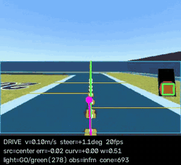

# AMET 2026 — Autonomous Driving Stack

Vision-based autonomous driving for the **2026 Autonomous Driving Hackathon (AMET)**,
built by **Team Autoway (6 members)** and advanced to the **finals**.

The vehicle must complete one lap of an unknown course within a 3-minute limit.
Penalties dominate the score, so the whole stack is designed around them:

| Event | Penalty |
|---|---|
| Collision | +5 s |
| Leaving the road (all four wheels) | +5 s |
| Starting on a red light | +10 s |

This ordering — **finish > safety > speed** — is the reason for most of the design
decisions documented below.

> **My role:** all of the code in this repository, the ROS 2 node architecture,
> and the technical direction of the run strategy.

**Environment:** developed and tuned entirely in the **physicar simulator**
(`physicar_ws`), which supplies the camera, LiDAR, and drive interface. On-site
practice was limited to three 10-minute sessions, so the stack was built to be
complete before arrival and tunable on the spot without a restart.



*Offline replay: cyan = detected road, magenta circle = aim point, yellow rows =
near/mid/far scan lines. Produced by `tools/replay.py` from recorded frames — no
simulator required.*

---

## Tech stack

- **ROS 2 Jazzy** (`rclpy`) — single-process node, timer-driven control loop
- **OpenCV + NumPy** — HSV segmentation, connected components, sliding-window
  polynomial fitting
- **PyYAML** — live-reloading configuration
- Standard interfaces only: `sensor_msgs/CompressedImage`,
  `sensor_msgs/LaserScan`, `std_msgs/Float64`

---

## Node structure

One node, `amet_driver`, runs the whole pipeline in a single process. Perception
is cheap enough (320 px wide) that splitting it across nodes would only add
serialization latency.

```
/camera/image_raw/compressed  (CompressedImage) ──┐
                                                  ├─> amet_driver ─┬─> /speed    (Float64, m/s)
/scan_filtered                (LaserScan)      ───┘   @ 20 Hz      └─> /steering (Float64, rad)
```

The `/scan_filtered` topic name is configurable via `obstacle.topic`.

### Control loop (one iteration)

```
latest camera frame
  ├─ lane.py     road mask -> orange centerline -> aim point + curvature
  ├─ lights.py   traffic light colour, debounced
  └─ obstacle.py forward LiDAR distance
        │
        v
     FSM  ──>  control.py   PD steering + curvature-scheduled speed
        │
        v
   publish /speed, /steering   (re-published every loop as a watchdog)
```

### Modules

| File | Responsibility |
|---|---|
| `amet_drive/main.py` | ROS 2 node, control loop, FSM, watchdog, clean-stop on exit |
| `amet_drive/lane.py` | Road segmentation and orange centre-line tracking |
| `amet_drive/lights.py` | Traffic light detection with asymmetric debouncing |
| `amet_drive/obstacle.py` | Forward-sector LiDAR distance → stop / slow-down scale |
| `amet_drive/control.py` | PD steering + curvature feed-forward, speed scheduling, slew limits |
| `amet_drive/config.py` | YAML loader that hot-reloads while driving |
| `amet_drive/viewer.py` | HTTP debug stream on port 5000 |

### FSM states

`WAIT_LIGHT` → `DRIVE` ⇄ `STOP_LIGHT` / `STOP_OBS` / `LANE_LOST`

The node **starts in `WAIT_LIGHT` and does not move** until it has either
confirmed a green light or confirmed that the course has no light at all
(`no_light_frames`, 100 frames ≈ 5 s), with a `start_max_wait` failsafe at 30 s
so a detection failure can never turn into a DNF.

---

## Design decisions worth calling out

**Follow the orange dashed centre line, not the widest asphalt.**
The course contains forks. Chasing the largest road region makes the car pick a
branch at random. The orange dashes are the course's own definition of the
correct path, so following them removes the fork problem entirely. The dashes are
discontinuous, which is handled by a bottom-up sliding window (each band searches
only within `±window` of the previous band) plus a 2nd-order polynomial fit. If
the orange line is lost, the controller falls back to the road-mask centre.

**Only the road region connected to the car is used.**
`_own_road()` keeps the connected component under the bottom-centre of the frame,
so roads visible in the background or across a fork cannot contaminate the fit.

**Traffic-light detection excludes road pixels.**
A traffic light is never on the asphalt, so subtracting the road mask from the
light ROI is the single strongest false-positive filter — it is what stopped the
orange road dashes from being read as a red light.

**The light logic is deliberately asymmetric.**
Running a red light costs 10 s; stopping unnecessarily costs only time. So red is
released far more slowly than green (`red_release_frames: 14` vs
`release_frames: 5`), and yellow is treated as red.

**Cones are avoided by subtracting them from the road mask.**
No separate avoidance controller exists. Removing the green cone pixels (plus
padding) from the drivable region makes the existing aim-point logic steer around
them automatically — the cheapest possible integration.

**Curvature is fed forward into steering.**
At a 90° corner the dashed line becomes horizontal in the image, so the lateral
error is near zero and a pure PD controller would slow down without turning. The
far-field road centre still shows the corner, so its curvature is added directly
to the steering command.

**Configuration hot-reloads while driving.**
`config.py` checks the file mtime every 0.5 s. On a parse error it keeps the
previous values and logs a warning rather than crashing. With only 10 minutes of
track time per session, restarting the stack to change a threshold was not
affordable.

**The node always stops the car on exit.**
`SIGINT`/`SIGTERM` and `destroy_node()` all publish zero speed before shutdown,
and drive commands are re-published every loop because they expire after ~1 s.

---

## Running

### On the simulator

```bash
cd ~/physicar_ws
source run.sh          # this is the evaluation entry point
```

`run.sh` sources ROS 2 Jazzy, puts `amet/` on `PYTHONPATH`, and launches
`python3 -m amet_drive.main`. All tuning happens in `amet/config.yaml`; the entry
point itself needs no edits.

With `general.debug_view: true`, an overlay stream is served on **port 5000**.

### Offline tuning (no simulator needed)

Most perception tuning does not require a running simulator — only recorded
frames.

```bash
# 1) record frames from the simulator while driving manually
python3 amet/tools/grab.py --n 400 --hz 10 --out capture

# 2) replay them through the exact same perception code
python3 amet/tools/replay.py --frames capture
#    -> replay_out.mp4 (overlay video), replay_out.csv, console summary

# 3) sweep a parameter and compare
python3 amet/tools/replay.py --frames capture \
    --sweep centerline.window=0.10,0.13,0.16,0.20
```

`replay.py` imports `lane.py`, `lights.py`, and `control.py` directly, so an
offline result is produced by the same code that drives the car. The sweep ranks
candidates by `center%` (higher is better), `lost%` and `jitter` (lower is
better), and prints a recommendation.

### Utilities

```bash
python3 amet/tools/tune.py         # HSV / ROI calibration UI on port 5000
python3 amet/tools/lidar_check.py  # verify topic, valid ranges, and 0° heading
```

`lidar_check.py` prints the closest distance per angular sector, which is how the
`angle_offset_deg` value was determined — "is 0° actually straight ahead" was the
most frequently wrong assumption.

---

## Results

**Competition outcome: advanced to the finals of the 2026 Autonomous Driving
Hackathon (AMET).**

### Perception, measured offline

`replay_out.csv` in this repository is the output of `tools/replay.py` over a
400-frame recording of the course (committed so the numbers can be reproduced):

| Metric | Value |
|---|---|
| Frames | 400 |
| Tracking the orange centre line | **93.5 %** |
| Fell back to road-mask centre | 5.8 % |
| No road found at all | 0.8 % |
| Frames in `LANE_LOST` | **0.8 %** |

`c2_out.csv` is a second, shorter recording (55 frames) at 100 % centre-line
tracking.

Reproduce with:

```bash
python3 amet/tools/replay.py --frames <recording> --no-video
```

### Tuning outcomes recorded in `config.yaml`

Each non-default value in `amet/config.yaml` carries the measurement that
justifies it. The ones that changed behaviour most:

| Change | Effect |
|---|---|
| `lane.roi_top` 0.50 → 0.45 | `LANE_LOST` 2.0 % → 0.8 % |
| `control.kd` 4.5 → 1.5 | steering jitter 4.08 → 2.09 deg/frame |
| `traffic_light.aspect_tol` 2.2 → 1.30 | cones misread as green light: 73 frames → 0 |
| `centerline.window` 0.16 → 0.28 | 0.16 failed to re-acquire the line after a gap |

The `aspect_tol` result is the clearest example of the penalty asymmetry driving
the design: traffic cones are tall triangles (aspect 0.45–0.73) while lamps are
round (0.95–1.00), so tightening the aspect ratio eliminated the false greens
without weakening real detection.

### Configuration snapshots

- `amet/config_baseline_before_tuning.yaml` — starting point
- `amet/config_ok_0824.yaml` — last configuration verified in the simulator
- `amet/config.yaml` — current

---

## Repository layout

```
run.sh                       evaluation entry point
amet/
  config.yaml                all tuning parameters (hot-reloaded)
  README.md                  field tuning guide (Korean)
  amet_drive/                the ROS 2 node
  tools/                     grab / replay / tune / lidar_check
docs/replay_demo.gif         offline replay overlay
replay_out.csv, c2_out.csv   replay outputs quoted above
```

`amet/README.md` is the operational tuning guide written for use during the
competition (symptom → parameter table, pre-submission checklist). It is kept in
Korean, as written on the day.
